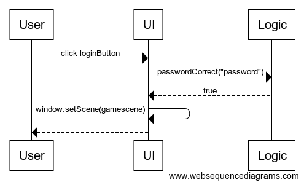
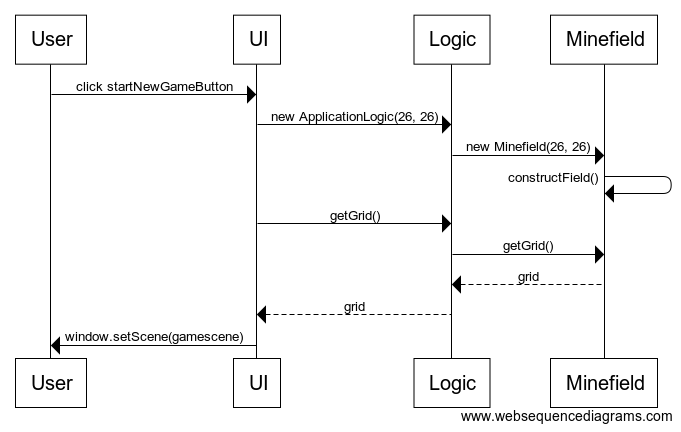

# Arkkitehtuurikuvaus

## Sovelluslogiikka

Sovelluksen osien suhdetta kuvaava luokka/pakkauskaavio:

### Päätoiminnallisuudet

Sovelluksen toimintalogiikan päätoiminnollisuuksien sekvenssikaaviot:

#### Kirjautuminen

#### Uuden pelin aloittaminen

Huom.! Uuden pelin aloittamista ei ole vielä toteutettu - uusi peli käynnistyy tällä hetkellä, kun sovellukseen kirjaudutaan sisään. Toiminto lisätään lähitulevaisuudessa.

