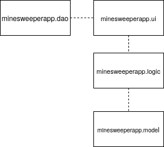
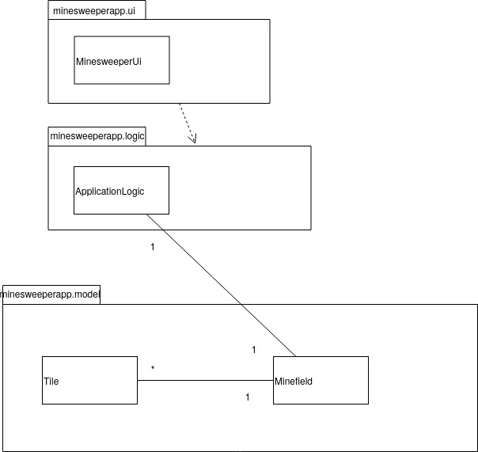
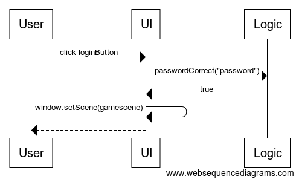
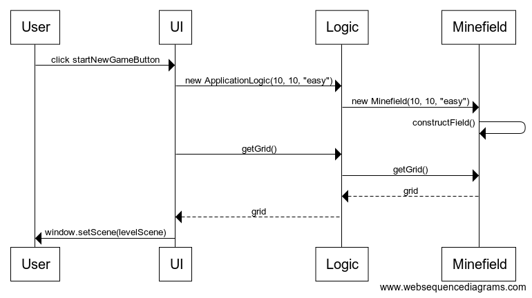

# Arkkitehtuurikuvaus

## Rakenne

Sovellus noudattaa neliosaista kerrosarkkitehtuuria:

Pakkaus _minesweeperapp.ui_ sisältää käyttöliittymän, _minesweeperapp.logic_ sovelluslogiikan ja _minesweeperapp.model_ miinakenttää sekä yksittäistä ruutua kuvaavat luokat. Tietokantaan liittyvät toiminnot sisältävä luokka löytyy pakkauksesta _minesweeperapp.dao_.

## Käyttöliittymä

Käyttöliittymä sisältää kolme erillistä näkymää:
- kirjautuminen
- tason valitseminen
- pelinäkymä

Kaikki näkymät on toteutettu omana Scene-olionaan, ja niistä on kerrallaan yksi näkyvissä eli sijoitettuna stageen.

Käyttöliittymä on rakennettu luokassa _minesweeperapp.ui.MinesweeperUi_. Käyttöliittymä on eriytetty sovelluslogiikasta, ja se kutsuu sovelluslogiikan metodeja.

## Sovelluslogiikka

Pelin toiminnollisuuden luovat luokat Minefield ja Tile, ja luokka ApplicationLogic yhdistää Minefield- ja Tile-luokkien toiminnallisuudet pelin logiikaksi.

Sovelluksen osien suhdetta kuvaava luokka/pakkauskaavio:

## Tietojen pysyväistalletus

Tietojen pysyväistalletukseen käytetään SQLite-tietokantaa. Pakkauksen _minesweeperapp.dao_ luokka Database huolehtii tietokantayhteyksistä sekä tiedon tallentamisesta ja hakemisesta tietokannasta. Sitä kutsutaan käyttöliittymästä: kun pelaaja aloittaa uuden pelin, tallentuu tästä tieto tietokantaan. Samaten kun käyttäjä siirtyy tasonäkymään, kutsutaan käyttöliittymästä Database-luokan metodia, joka hakee tietokannasta pelaajan pelikertojen summan ja näyttää sen pelaajalle. Pelikertojen määrä päivittyy aina uuden pelin pelaamisen jälkeen.

## Päätoiminnallisuudet

Seuraavaksi esitellään kaksi sovelluksen toimintalogiikan päätoiminnallisuutta sekvenssikaavioina.

### Kirjautuminen

Kun käyttäjä syöttää kirjautumisnäkymässä salasanan ja painaa `Login`, etenee sovelluksen kontrolli seuraavasti:

Nappulan painamiseen reagoiva tapahtumakäsittelijä kutsuu sovelluslogiikan ApplicationLogic metodia passwordCorrect parametrinaan syötetty salasana. Jos salasana on oikea, kirjautuminen onnistuu ja näkymäksi vaihtuu levelScene, jossa käyttäjä pääsee valitsemaan vaikeustason.

### Uuden pelin aloittaminen

Kun käyttäjä on valinnut vaikeustason (sekvenssikaaviossa tasoksi on valittu "easy") ja painanut `Start`, peli käynnistyy ja sovelluksen kontrolli etenee seuraavasti:

Käyttöliittymä kutsuu logiikan kautta Minefield-luokassa uuden pelikentän rakentavaa constructField-metodia ja tämän jälkeen liittää rakennetun pelikentän käyttöliittymää kutsumalla getGrid-metodia. Pelinäkymä avautuu nyt pelaajalle.
