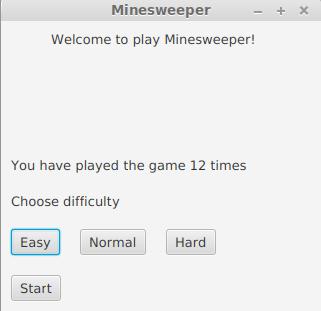

# Käyttöohje

Lataa tiedosto [Minesweeper.jar](https://github.com/sinisaarinen/ot-harjoitustyo/releases/tag/viikko6)

## Käynnistys

Sovellus käynnistetään komennolla
```
java -jar Minesweeper.jar
```

## Kirjautuminen

Ohjelma avautuu aluksi kirjautumisnäkymään. Syötä salasana _password_ ja paina `Login`.


## Tason valitseminen

Seuraavaksi pääset valitsemaan pelin tasoksi joko helpon, normaalin tai vaikean tason. Klikkaa haluamaasi tasoa ja paina `Start`.


