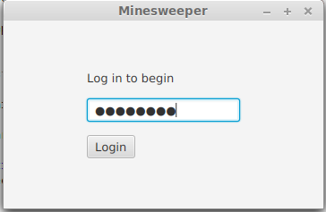
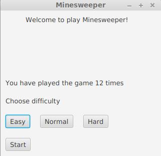
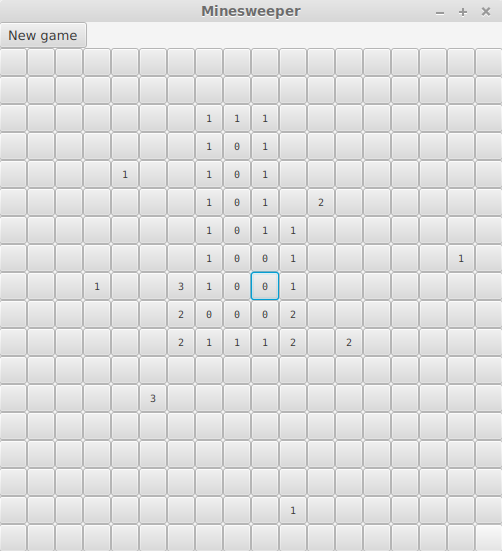
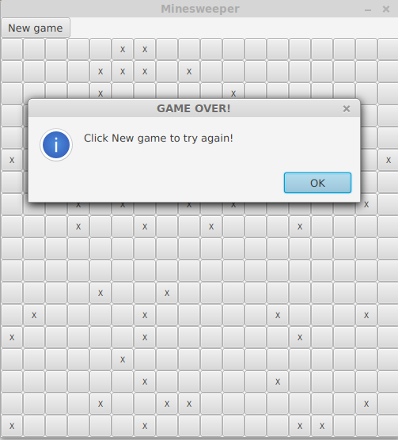

# Käyttöohje

Lataa tiedosto [MinesweeperApp.jar](https://github.com/sinisaarinen/ot-harjoitustyo/releases/tag/Loppupalautus)

## Käynnistys

Sovellus käynnistetään komennolla
```
java -jar MinesweeperApp.jar
```

## Kirjautuminen

Ohjelma avautuu aluksi kirjautumisnäkymään. Syötä salasana _password_ ja paina `Login`.



## Tason valitseminen

Seuraavaksi pääset valitsemaan pelin tasoksi joko helpon, normaalin tai vaikean tason. Klikkaa haluamaasi tasoa ja paina `Start`.

Tässä näkymässä näet myös kuinka monta kertaa olet pelannut peliä.



## Peli alkaa

Nyt voit aloittaa pelaamisen. Klikkaamalla ruutuja ne avautuvat, ja niistä paljastuu joko niitä ympäröivien miinojen lukumäärä (0-8) tai miina. Miinan voi merkitä klikkaamalla ruutua hiiren oikealla painikkeella. Voitat pelin klikkaamalla auki kaikki miinattomat ruudut. Jos haluat aloittaa uuden pelin tai vaihtaa tasoa, paina `New game`.



## Game over

Jos klikkaat miinaa, peli päättyy ja kaikkien jäljellä olevien miinojen sijainnit ilmestyvät peliruudulle. Voit aloittaa uuden pelin klikkaamalla `New game`.


