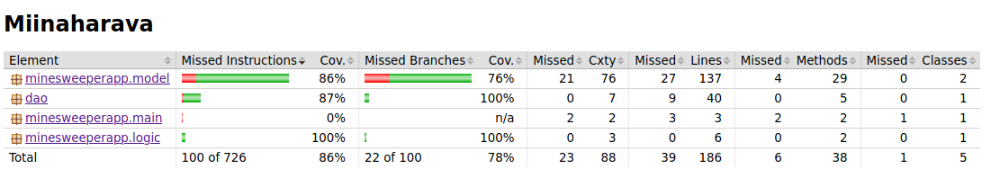

# Testausdokumentti

Ohjelmaa on testattu sekä yksikkö- ja integraatiotasolla että järjestelmätasolla. Yksikkö- ja integraatiotestaus on suoritettu automatisoidusti JUnitilla ja järjestelmätestaus manuaalisesti.

## Yksikkö- ja integraatiotestaus

### Sovelluslogiikka

Sovelluslogiikkaa eli model- ja logic-pakettien luokkia testattiin kolmen eri testiluokan avulla. Model-pakettiin kuuluvista luokista TileTest vastaa Tile-luokan ja MinefieldTest Minefield-luokan testauksesta. Minefield-luokka sisältää myös integraatiotestausta, jossa testataan molempia luokkia Minefield ja Tile. Logic-paketin luokkaa ApplicationLogic testaa testiluokka ApplicationLogicTest.

### DAO-luokka

DAO-luokkaa Database testaa testiluokka DaoTest, joka käyttää testitietokantaa.

### Testikattavuus

Testauksen rivikattavuus on 86% ja haaraumakattavuus 78%, kun käyttöliittymää ei oteta huomioon. Testaamatta jäi Tile-luokkaan sisällytetty JavaFX:ään kuuluva hiirenklikkauksen käsittely, DAO-luokan SQLExceptioneiden käsittely ja Minefield-luokasta voittoon ja häviöön liittyvät Alertit sekä yksittäisiä rivejä muista metodeista. 

## Järjestelmätestaus

Sovelluksen järjestelmätestaus tehtiin manuaalisesti. Sovellus asennettiin ja testattiin käyttöohjeesta löytyvien ohjeiden mukaan. Testauksessa käytiin läpi kaikki määrittelydokumentista ja käyttöohjeesta löytyvät toiminnallisuudet.

## Sovellukseen jääneet laatuongelmat

Sovelluksessa voi tällä hetkellä aloittaa pelin valitsematta tasoa tasonäkymässä, jolloin pelinäkymä avautuu ilman miinakenttää. Ongelma ei ole kuitenkaan suuri, koska tasonäkymään pääsee takaisin `New game`-nappia painamalla. Ongelma ei ilmene, jos pelaaja on jo pelannut yhden tai useamman pelin ja aloittaa uuden pelin - tällöin tason valitsematta jättäminen johtaa siihen, että peli valitsee tasoksi aiemmassa pelissä tehdyn tasovalinnan.
